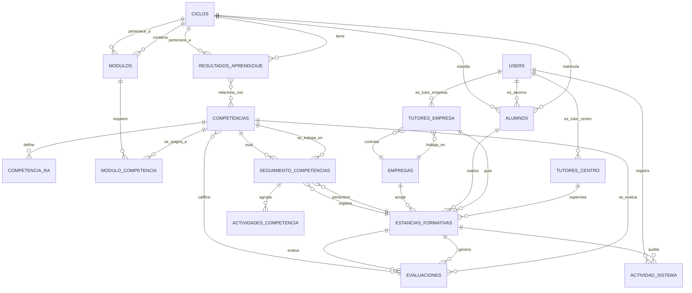

# Modelo Entidad Relación (MER)
## Sistema de Gestión de Estancias Formativas - Egibide



---

## Descripción de Tablas Clave

### 📚 **Gestión Académica**
- **`ciclos`**: Ciclos formativos (Superior, Medio)
- **`resultados_aprendizaje`**: RAs de cada ciclo
- **`modulos`**: Módulos de cada ciclo
- **`competencias`**: Competencias técnicas, transversales y personales

### 👥 **Usuarios y Roles**
- **`users`**: Tabla central de usuarios (base para autenticación)
- **`tutores_centro`**: Extensión de users para tutores del centro
- **`tutores_empresa`**: Extensión de users para tutores empresariales
- **`alumnos`**: Extensión de users para estudiantes

### 🏢 **Gestión de Empresas**
- **`empresas`**: Datos de empresas colaboradoras
- **`tutores_empresa`**: Tutores asignados a cada empresa

### 🎓 **Estancias (Núcleo del Sistema)**
- **`estancias_formativas`**: Registro de cada estancia alumno-empresa
- **`seguimiento_competencias`**: **TABLA CLAVE** - Seguimiento semanal de competencias
- **`actividades_competencia`**: Tareas dentro de cada competencia semanal
- **`evaluaciones`**: Evaluaciones parciales y finales

### 🔗 **Relaciones Intermedias (Muchos a Muchos)**
- **`competencia_ra`**: RA ↔ Competencias
- **`modulo_competencia`**: Módulos ↔ Competencias

### 📋 **Auditoría**
- **`actividad_sistema`**: Registro de todas las acciones del sistema

---

## Flujo de Datos Principal

```
1. CICLO (ej: DAM)
   ├── Módulos (Programación, BD, etc)
   ├── RAs (Resultado de Aprendizaje)
   └── Competencias (Técnicas, transversales)

2. ALUMNO se matricula en CICLO

3. ESTANCIA FORMATIVA (Alumno → Empresa)
   ├── Asignado Tutor Centro
   ├── Asignado Tutor Empresa
   └── Duración: fecha_inicio → fecha_fin

4. SEGUIMIENTO SEMANAL (El corazón del sistema)
   ├── Cada semana se evalúan competencias
   ├── Se registran actividades realizadas
   ├── Se evalúan por tutor empresa y centro
   └── Estado: NO_INICIADA → EN_PROGRESO → COMPLETADA

5. EVALUACIONES
   ├── Parciales (semanales)
   ├── Finales (al completar estancia)
   └── Califican competencias específicas
```

---

## Cardinalidades Principales

| Relación | Tipo | Descripción |
|----------|------|-------------|
| Ciclo → Módulos | 1:N | Un ciclo tiene muchos módulos |
| Ciclo → RAs | 1:N | Un ciclo genera múltiples RAs |
| Ciclo → Alumnos | 1:N | Un ciclo tiene muchos alumnos |
| Competencias ↔ RAs | N:M | Una competencia cubre varios RAs |
| Módulos ↔ Competencias | N:M | Un módulo requiere varias competencias |
| Empresa → Tutores | 1:N | Una empresa tiene varios tutores |
| Estancia → Seguimiento | 1:N | Una estancia genera múltiples registros semanales |
| Estancia → Evaluaciones | 1:N | Una estancia tiene varias evaluaciones |

---

## Notas Importantes

✅ **Ventajas del diseño:**
- Trazabilidad completa de competencias
- Separación clara de roles (Admin, Tutor Centro, Tutor Empresa, Alumno)
- Auditoría integrada
- Flexibilidad para tipos de competencias
- Tabla de seguimiento semanal (perfecto para el tracking que necesitas)

⚠️ **Consideraciones:**
- Las migraciones deben respetarse en el orden correcto (FK constraints)
- La tabla `seguimiento_competencias` es crucial: registra QUÉ competencias se trabajan CADA SEMANA
- Usa soft deletes en `users` para mantener histórico

