```mermaid
erDiagram
    %% ====================================================================
    %% ESTRUCTURA ACADÉMICA
    %% ====================================================================
    
    ciclos {
        int id PK
        varchar codigo UK "Código del ciclo"
        varchar nombre "Nombre del ciclo"
        int nivel "Nivel del ciclo"
        boolean activo
        timestamp created_at
        timestamp updated_at
    }
    
    cursos {
        int id PK
        int id_ciclo FK
        int numero_curso "1, 2, 3..."
        varchar nombre "1º DAM, 2º DAM"
        timestamp created_at
        timestamp updated_at
    }
    
    resultados_aprendizaje {
        int id PK
        varchar codigo UK "Código del RA"
        text descripcion
        int id_ciclo FK
        timestamp created_at
        timestamp updated_at
    }
    
    competencias {
        int id PK
        varchar codigo UK "Código competencia"
        text descripcion
        enum tipo "TECNICA,TRANSVERSAL,PERSONAL"
        timestamp created_at
        timestamp updated_at
    }
    
    competencia_ra {
        int id PK
        int id_competencia FK
        int id_ra FK
        timestamp created_at
    }
    
    modulos {
        int id PK
        varchar codigo UK "Código módulo"
        varchar nombre
        int id_curso FK
        int horas_totales
        timestamp created_at
        timestamp updated_at
    }
    
    modulo_competencia {
        int id PK
        int id_modulo FK
        int id_competencia FK
        timestamp created_at
    }
    
    %% ====================================================================
    %% USUARIOS Y ROLES
    %% ====================================================================
    
    users {
        bigint id PK
        varchar nombre
        varchar apellidos
        varchar email UK
        varchar telefono
        enum rol "ADMIN,TUTOR_CENTRO,TUTOR_EMPRESA,ALUMNO"
        varchar password
        boolean activo
        timestamp email_verified_at
        timestamp created_at
        timestamp updated_at
        timestamp deleted_at "Soft delete"
    }
    
    alumnos {
        int id PK
        bigint id_user FK,UK
        varchar dni UK
        varchar numero_cuaderno "Nº expediente"
        int id_ciclo FK
        int curso_actual "1, 2, 3..."
        varchar poblacion
        timestamp created_at
        timestamp updated_at
    }
    
    %% ====================================================================
    %% EMPRESAS
    %% ====================================================================
    
    empresas {
        int id PK
        varchar nombre
        varchar cif UK
        varchar direccion
        varchar localidad
        varchar provincia
        varchar codigo_postal
        varchar telefono
        varchar email
        enum estado "ACTIVA,INACTIVA,SUSPENDIDA"
        timestamp created_at
        timestamp updated_at
    }
    
    contactos_empresa {
        int id PK
        int id_empresa FK
        varchar nombre
        varchar apellidos
        varchar email
        varchar telefono
        boolean activo
        timestamp created_at
        timestamp updated_at
    }
    
    %% ====================================================================
    %% ESTANCIAS FORMATIVAS
    %% ====================================================================
    
    estancias_formativas {
        int id PK
        int id_alumno FK
        int id_empresa FK
        bigint id_tutor_empresa FK "Usuario TUTOR_EMPRESA"
        bigint id_tutor_centro FK "Usuario TUTOR_CENTRO"
        int id_curso FK
        date fecha_inicio
        date fecha_fin
        int horas_totales
        int horas_realizadas
        enum estado "PLANIFICADA,EN_CURSO,COMPLETADA,CANCELADA"
        text observaciones
        timestamp created_at
        timestamp updated_at
    }
    
    horarios_estancia {
        int id PK
        int id_estancia FK
        enum dia_semana "LUNES,MARTES,MIERCOLES,JUEVES,VIERNES,SABADO,DOMINGO"
        enum turno "MAÑANA,TARDE,NOCHE,CONTINUO"
        time hora_inicio
        time hora_fin
        timestamp created_at
        timestamp updated_at
    }
    
    seguimiento_competencias {
        int id PK
        int id_estancia FK
        int id_competencia FK
        int numero_semana "Semana de trabajo"
        date fecha_inicio
        date fecha_fin
        timestamp created_at
        timestamp updated_at
    }
    
    notas_seguimiento {
        int id PK
        int id_estancia FK
        int id_alumno FK
        date fecha
        enum accion "PRESENTACION_ALUMNO,LLAMADA_SEGUIMIENTO,VISITA_CENTRO_TRABAJO,etc"
        text contenido
        timestamp created_at
        timestamp updated_at
    }
    
    %% ====================================================================
    %% EVALUACIONES
    %% ====================================================================
    
    evaluaciones {
        int id PK
        int id_estancia FK
        int id_modulo FK
        decimal nota_previa "80% nota final"
        decimal nota_competencias_tecnicas "0-10"
        decimal nota_competencias_transversales "0-10"
        decimal nota_cuaderno "0-10"
        decimal nota_fct_calculada "20% nota final"
        decimal nota_final "80% previa + 20% FCT"
        text observaciones
        date fecha_evaluacion
        timestamp created_at
        timestamp updated_at
    }
    
    %% ====================================================================
    %% SISTEMA
    %% ====================================================================
    
    logs {
        bigint id PK
        bigint id_usuario FK
        enum nivel "DEBUG,INFO,WARNING,ERROR,CRITICAL"
        varchar tipo "auth,database,api,email..."
        text mensaje
        json contexto
        varchar tabla_afectada
        int registro_id
        varchar ip
        text user_agent
        varchar url
        varchar metodo_http
        timestamp created_at
    }
    
    %% ====================================================================
    %% RELACIONES
    %% ====================================================================
    
    %% Estructura Académica
    ciclos ||--o{ cursos : "tiene"
    ciclos ||--o{ resultados_aprendizaje : "define"
    ciclos ||--o{ alumnos : "matricula"
    
    cursos ||--o{ modulos : "contiene"
    cursos ||--o{ estancias_formativas : "se_realiza_en"
    
    competencias ||--o{ competencia_ra : "relaciona"
    competencias ||--o{ modulo_competencia : "se_asigna"
    competencias ||--o{ seguimiento_competencias : "se_trabaja"
    
    resultados_aprendizaje ||--o{ competencia_ra : "relaciona"
    
    modulos ||--o{ modulo_competencia : "requiere"
    modulos ||--o{ evaluaciones : "se_evalua"
    
    %% Usuarios
    users ||--o{ alumnos : "es_alumno"
    users ||--o{ estancias_formativas : "tutor_empresa"
    users ||--o{ estancias_formativas : "tutor_centro"
    users ||--o{ logs : "genera"
    
    alumnos ||--o{ estancias_formativas : "realiza"
    alumnos ||--o{ notas_seguimiento : "tiene_notas"
    
    %% Empresas
    empresas ||--o{ contactos_empresa : "tiene_contactos"
    empresas ||--o{ estancias_formativas : "acoge"
    
    %% Estancias
    estancias_formativas ||--o{ horarios_estancia : "tiene_horario"
    estancias_formativas ||--o{ seguimiento_competencias : "registra"
    estancias_formativas ||--o{ notas_seguimiento : "documenta"
    estancias_formativas ||--o{ evaluaciones : "genera"
```

## Descripción del Diagrama

### Colores y Agrupaciones

- **🔵 Azul**: Estructura académica (ciclos, cursos, módulos, competencias, RAs)
- **🟢 Verde**: Usuarios y roles (users, alumnos)
- **🟡 Amarillo**: Empresas y contactos
- **🔴 Rojo**: Estancias y seguimiento
- **🟣 Morado**: Evaluaciones
- **⚫ Gris**: Sistema (logs)

### Cardinalidades

- `||--o{` : Uno a muchos
- `||--||` : Uno a uno
- `}o--o{` : Muchos a muchos

### Tablas Pivot (Relaciones N:M)

1. **`competencia_ra`**: Competencias ↔ Resultados de Aprendizaje
2. **`modulo_competencia`**: Módulos ↔ Competencias

### Flujo Principal de Datos

```
Ciclo → Cursos → Módulos → Competencias
                          ↓
Alumno → Estancia → Seguimiento Semanal → Evaluación
         ↓
      Empresa
```

### Notas Importantes

- **Users** es la tabla central de autenticación con 4 roles
- **Estancias Formativas** conecta alumnos, empresas y tutores
- **Seguimiento Competencias** es el núcleo del tracking semanal
- **Evaluaciones** calcula automáticamente las notas FCT

### Restricciones de Integridad

- **ON DELETE CASCADE**: competencia_ra, modulo_competencia, contactos_empresa, horarios_estancia, seguimiento_competencias, notas_seguimiento, evaluaciones
- **ON DELETE RESTRICT**: ciclos, cursos, modulos, alumnos, empresas, users (tutores)
- **ON DELETE SET NULL**: logs (id_usuario)
